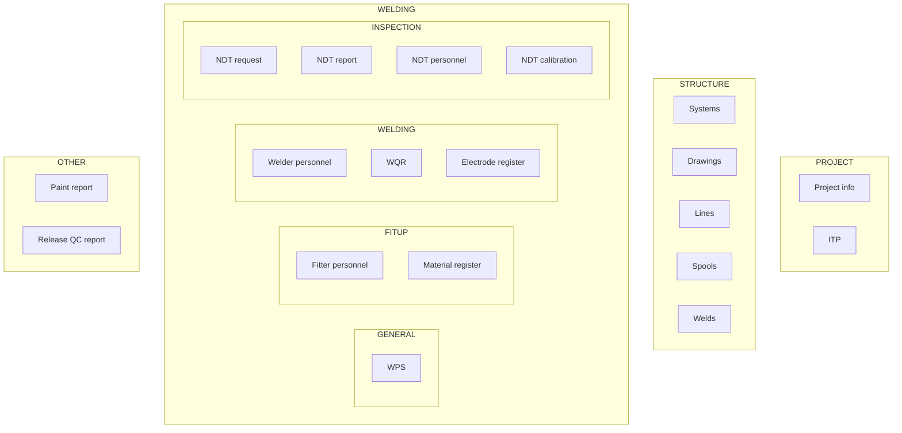

# Settings categories and navigation reorganization

## Current state

- **Nav** is a flat `navGroups` array in [`components/ModalParameters.jsx`](components/ModalParameters.jsx) (~550–589): Project / Libraries / Documents & QA / optional Structure.
- **Default section** on open: `project-ndt` (~68, ~118–120).
- **Structure** only appears when `structureIntegration` is truthy; today that object is built only when `pdfBlob` is set in [`app/app/page.jsx`](app/app/page.jsx) (~1949–1987), so **Systems** (which lives outside structure in nav) disappears with the whole Structure group when there is no PDF — this conflicts with “STRUCTURE” always listing **systems** and **weld**.
- **Personnel** is a single [`SettingsPersonnelRegistry`](components/settings/SettingsPersonnelRegistry.jsx) block (~659–691).
- **Vault categories** already exist in [`lib/settings-documents.js`](lib/settings-documents.js): `ndt_qualification`, `ndt_calibration`, `final_release` (“Final release / QC approval”) — not yet wired as separate Settings rows.
- **`ndtRequests`** is passed into `ModalSettings` but **not** applied in the parent `onSave` handler in [`app/app/page.jsx`](app/app/page.jsx) (~2843–2869), so any new NDT-request editor must extend `pushProjectSave` / `onSave` payloads consistently.

## Target information architecture

**No project “NDT & welding spec” Settings screen:** Do **not** expose a menu item or panel for the current `project-ndt` block (project-level NDT requirements table + welding spec string). NDT-related project workflow is covered by **INSPECTION** (NDT request, NDT report, NDT personnel, NDT calibration) and related data elsewhere. **Implementation detail:** Remove or omit the `activeSection === "project-ndt"` / `welding-spec` UI from Settings; persisted `drawingSettings` may remain in `.weldproject` for backward compatibility until a later data migration (optional follow-up).

**Databook export out of scope for now:** Do **not** include **Databook export** in the reorganized Settings nav. Leave [`SettingsDatabookExportPanel`](components/settings/SettingsDatabookExportPanel.jsx) and databook compile logic in the codebase for a future reintroduction; only drop wiring from the Settings modal during this work.

**Copy note:** Top-level **OTHER** is a placeholder label until product naming is final; subsection **Release QC** maps to vault category `final_release` (rename label in [`lib/settings-documents.js`](lib/settings-documents.js) to match “Release QC report”).

**Placement choices (aligned with your list, plus gaps):**

| Your list                                         | Implementation                                                                                                                                                                                              |
| ------------------------------------------------- | ----------------------------------------------------------------------------------------------------------------------------------------------------------------------------------------------------------- |
| PROJECT: main info, ITP                           | `project-info`, `itp` only (no databook in Settings)                                                                                                                                                        |
| STRUCTURE: drawings, systems, lines, spools, weld | Move **systems** into STRUCTURE; keep drawings/lines/spools gated on PDF-backed integration; add **welds** via embedded [`SidePanelWeldForm`](components/SidePanelWeldForm.jsx) (project-wide `weldPoints`) |
| WELDING sections                                  | See table below                                                                                                                                                                                             |
| OTHER: paint, releaseQC                           | `painting_report`, `final_release` via [`SettingsDocumentCategoryRegistry`](components/settings/SettingsDocumentCategoryRegistry.jsx)                                                                       |

## WELDING subsection keys (stable `activeSection` ids)

Use explicit keys (rename labels in nav only):

| Subsection | Keys                                                                                                                  |
| ---------- | --------------------------------------------------------------------------------------------------------------------- |
| GENERAL    | `wps` only (no `welding-spec` / `project-ndt`)                                                                        |
| FITUP      | `personnel-fitters`, `materials`                                                                                      |
| WELDING    | `personnel-welders`, `electrodes` (WQR lives inside welders section as today)                                         |
| INSPECTION | `ndt-requests`, `ndt-reports`, `ndt-personnel-docs` (`ndt_qualification`), `ndt-calibration-docs` (`ndt_calibration`) |

**WQR:** Keep WQR table embedded under **Welder personnel** (same [`SettingsPersonnelRegistry`](components/settings/SettingsPersonnelRegistry.jsx) content as today for welders + WQR), so the nav label **WQR** can be descriptive text (“Welder personnel / WQR”) to avoid duplicating a dead-end item.

## Implementation steps

### 1. Nav data model and renderer

- Replace flat `navGroups` with a structure that supports **subsection headings** under **WELDING** only (e.g. each group has `items: Array<{ key, label } | { type: 'heading', label }>` or nested `subgroups`).
- Update the sidebar map in [`ModalParameters.jsx`](components/ModalParameters.jsx) (~604–625) to render subsection labels (small uppercase text, same pattern as group titles) between button groups.
- Set **default section** to `project-info` and reset on open to match **PROJECT** first item (~68, ~118–120).
- **Remove** Settings entries and panels for **NDT & welding spec** (`project-ndt`) and **Databook export** (`databook-export`).

### 2. Split [`SettingsPersonnelRegistry`](components/settings/SettingsPersonnelRegistry.jsx)

- Add a prop such as `variant: 'full' | 'fitters' | 'welders-wqr'` (default `'full'` for backward compatibility).
- **`fitters`:** render only the Fitters block + intro line for fitters.
- **`welders-wqr`:** render Welders + WQR blocks only (omit fitters intro or replace with one line).
- Wire `activeSection === 'personnel-fitters'` and `'personnel-welders'` to two panels with shared handlers (reuse existing props; same hidden WQR file input at modal bottom).

### 3. STRUCTURE: visibility and new **Welds** panel

- **Change [`settingsStructureIntegration`](app/app/page.jsx)** from “null without PDF” to an **object that is always defined** when the app is running with a project, e.g. `{ drawings, lines, spools, welds }` where `drawings/lines/spools` are only set when `pdfBlob` is present, and **`welds` always** carries props needed for `SidePanelWeldForm` (project-wide `weldPoints`, `weldStatusByWeldId`, `getWeldName`, `spools`, `parts`, `lines`, `personnel`, `wpsLibrary`, `electrodeLibrary`, `drawingSettings`, `onSave`/`onDelete`/`onUpdatePartHeat`, `appMode`).
- **Local state** inside `ModalSettings` for selected weld / form weld when showing the welds section (do not reuse main app `formWeld` to avoid coupling).
- **Nav:** **STRUCTURE** group is **always** shown; items **Drawings / Lines / Spools** are omitted or disabled when the corresponding integration slice is missing (no PDF). **Systems** and **Welds** always available.
- Move the existing **systems** panel branch (`activeSection === 'systems'`) unchanged in behavior; only nav grouping changes.

### 4. INSPECTION: NDT request list

- Add a focused **SettingsNdtRequestsRegistry** (new file under `components/settings/`) that lists `ndtRequests`, create/edit via existing [`FormNdtRequest`](components/FormNdtRequest.jsx) (requires `NdtScopeProvider` — already wraps the app tree in [`app/app/page.jsx`](app/app/page.jsx) ~2014).
- Persist with **onSave** including **ndtRequests**: extend [`handlePersistNdt`](components/ModalParameters.jsx) or add `handlePersistNdtRequests`, and extend [`pushProjectSave`](components/ModalParameters.jsx) where needed.
- Update [`app/app/page.jsx`](app/app/page.jsx) `ModalSettings` `onSave` (~2843–2869) to `if (nreq != null) setNdtRequests(nreq)` (and pass `ndtRequests` from any new handler).

### 5. INSPECTION: document vaults

- Add three `activeSection` branches using **SettingsDocumentCategoryRegistry** with `category="ndt_qualification"`, `ndt_calibration`, and `final_release` (same handlers as ITP/painting).
- Update [`lib/settings-documents.js`](lib/settings-documents.js) label for `final_release` to **“Release QC report”** (or equivalent) so UI matches **OTHER**.

### 6. Regression and copy

- Search for old section keys (`personnel`, `project-ndt` as default) in the repo; update any tests or deep links if present.
- Adjust modal subtitle (“Project defaults…”) if needed to reflect categories.

## Files to touch (primary)

- [`components/ModalParameters.jsx`](components/ModalParameters.jsx) — nav, sections, `structureIntegration` typing, new panels, `onSave` payload, imports (`SidePanelWeldForm`); **remove** `project-ndt` and `databook-export` panels from Settings.
- [`components/settings/SettingsPersonnelRegistry.jsx`](components/settings/SettingsPersonnelRegistry.jsx) — `variant` split.
- [`components/settings/SettingsNdtRequestsRegistry.jsx`](components/settings/SettingsNdtRequestsRegistry.jsx) — new (NDT requests only).
- [`app/app/page.jsx`](app/app/page.jsx) — `settingsStructureIntegration` shape, `ModalSettings` `onSave` for `ndtRequests`, weld integration props.
- [`lib/settings-documents.js`](lib/settings-documents.js) — optional label tweak for `final_release`.

## Risk notes

- **SidePanelWeldForm** in a modal must receive **full-project** `weldPoints` and related data; verify scroll/performance on large projects (acceptable for MVP).
- **Systems** without PDF: users can edit systems from Settings even when drawing-backed structure tabs are hidden — intentional per your STRUCTURE definition.
- **Removing project NDT defaults UI:** Any code that assumed users set `drawingSettings.ndtRequirements` / `weldingSpec` only via Settings may need follow-up (e.g. defaults from constants, line/system overrides, or NDT workflows only).
